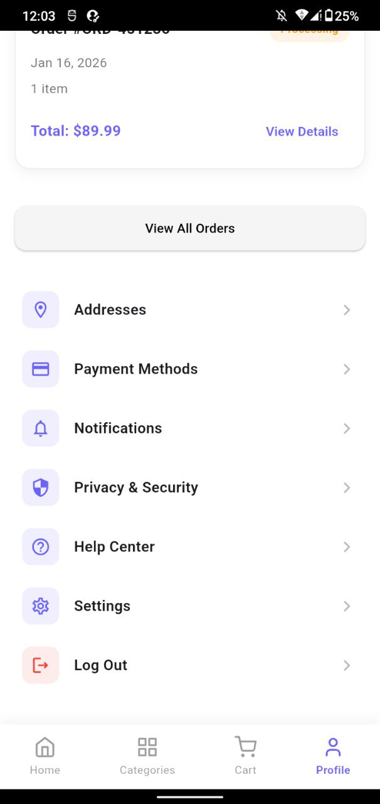
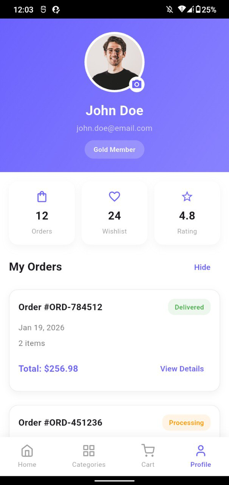
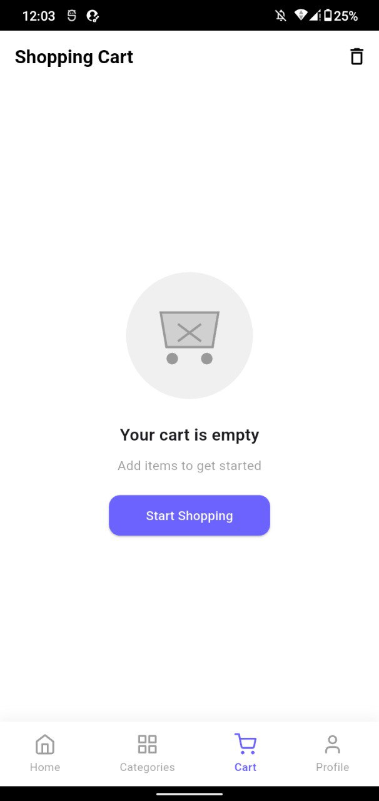
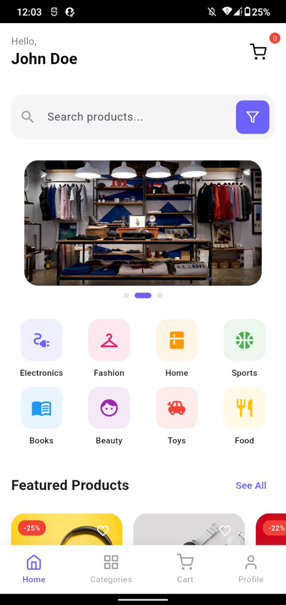

# E-Commerce App

A modern e-commerce mobile application built with Flutter, featuring a clean UI, smooth animations, and comprehensive shopping features.

## Features

- 🏠 **Home Screen** - Browse featured products and categories
- 📱 **Product Categories** - Explore products by category with filtering options
- 🛒 **Shopping Cart** - Add, remove, and manage cart items
- 🔍 **Search** - Search for products with trending suggestions
- 👤 **User Profile** - View orders, settings, and account management
- 💳 **Checkout** - Complete purchases with multiple payment methods
- ⭐ **Product Details** - View product images, reviews, and specifications

## Screenshots

<div style="display: flex; flex-wrap: wrap; gap: 10px;">
  
  
  
  
</div>

## Tech Stack

- **Flutter** - UI framework
- **Provider** - State management
- **flutter_svg** - SVG rendering
- **cached_network_image** - Image caching
- **carousel_slider** - Image carousels
- **animations** - Page transitions and animations
- **flutter_staggered_animations** - Staggered list animations
- **like_button** - Interactive like button
- **badges** - Badge widgets for cart items

## Getting Started

### Prerequisites

- Flutter SDK (3.9.2 or higher)
- Dart SDK
- Android Studio / VS Code
- Android device or emulator

### Installation

1. Clone the repository:
```bash
git clone <repository-url>
cd ecommerce
```

2. Install dependencies:
```bash
flutter pub get
```

3. Run the app:
```bash
flutter run
```

## Project Structure

```
lib/
├── app/
│   └── theme/           # App theme and styles
├── features/
│   ├── cart/           # Shopping cart screen
│   ├── categories/     # Categories screen
│   ├── checkout/       # Checkout screen
│   ├── home/           # Home screen and widgets
│   ├── product/        # Product detail screen
│   ├── profile/        # Profile screen
│   └── search/         # Search screen
├── models/             # Data models
├── services/           # Dummy data and services
├── widgets/            # Shared widgets
└── main.dart          # App entry point
```

## Features In Detail

### Home Screen
- Featured products carousel
- Category grid with icons
- Product cards with ratings and prices
- Quick access to cart and search

### Product Categories
- Filter by price range and brands
- Sort products by various criteria
- Grid view of products
- Smooth page transitions

### Shopping Cart
- Add/remove items
- Update quantities
- Calculate totals with tax and shipping
- Empty cart state

### Checkout
- Multiple delivery addresses
- Payment method selection (Credit Card, PayPal, Apple Pay, Google Pay)
- Order summary
- Promo code support

### Product Details
- Image carousel
- Size and color selection
- Product reviews
- Add to cart with quantity selector
- Share product

### Profile
- Order history
- Account settings
- Notifications toggle
- Help center access

## Contributing

Contributions are welcome! Please feel free to submit a Pull Request.

## License

This project is licensed under the MIT License - see the LICENSE file for details.
